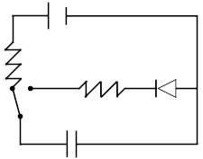
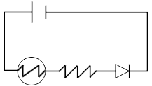

## 1 
A motor 

Yes, speaks counter clockwise

## 2
Lamp 

Series

Intensity

## 3
Parallel

Voltage

## 4
The motor turns on

## 5
Potentiometer 

Yes

## 6
Limits or regulates the flow of electrical current in an electronic circuit

Positive

No

## 7

## 8

## 11
RGB Led

Because there are 3 positives but only 1 negative

Red and Green

Procude complex colours

## 12

## 13

## 14
Have multiple switches for one light bulb

## 15
Send help, this was 2 dumb

## 16 

Capacitor

Store electricity

Stores less electricity

Less light

## 17

Diodo zener

One of the diodos is backwards

## 18

Photoresister, light dependent resister (LDR)

Light

## 19
Send help

## 20
Send help

## 21
void setup()
{
pinmode(4, OUTPUT);
}

void loop()
{
digitalwrite(4,HIGH);
delay(1000);

digitalwrite(4,LOW);
delay(2000);
}

## 22
void setup()
{
pinmode(4, OUTPUT);
}

void loop()
{
digitalwrite(4,HIGH);
delay(1000);

digitalwrite(4,LOW);
delay(2000);
}

## 23
void setup()
{
pinmode(4, OUTPUT);
}

void loop()
{
digitalwrite(4,HIGH);
delay(1000);

digitalwrite(4,LOW);
delay(2000);
}

## 24
void setup()
{
pinmode(4, OUTPUT);
pinmode(5, OUTPUT);
}

void loop()
{
digitalwrite(4,HIGH);
digitalwrite(5,HIGH);
delay(1000);

digitalwrite(4,LOW);
digitalwrite(5,HIGH);
delay(2000);
}

## 25
void setup()
{
pinmode(4, OUTPUT);
pinmode(5, OUTPUT);
}

void loop()
{
digitalwrite(4,HIGH);
delay(1000);

digitalwrite(4,LOW);
delay(2000);

digitalwrite(4,HIGH);
delay(1000);

digitalwrite(4,LOW);
delay(2000);

digitalwrite(4,HIGH);
delay(1000);

digitalwrite(4,LOW);
delay(2000);

digitalwrite(5,HIGH);
delay(1000);

digitalwrite(5,LOW);
delay(2000)
}

## 26
void setup()
{
pinmode(4, OUTPUT);
pinmode(5, OUTPUT);
}

void loop()
{
digitalwrite(4,HIGH);
digitalwrite(5,LOW);
delay(1000);

digitalwrite(4,LOW);
digitalwrite(5,HIGH);
delay(1000);
}

## 27
void setup()
{
pinmode(4, OUTPUT);
pinmode(5, OUTPUT);
pinmode(6, OUTPUT);
}

void loop()
{
digitalwrite(4,HIGH);
digitalwrite(5,LOW);
digitalwrite(6,LOW);
delay(500);

digitalwrite(4,LOW);
digitalwrite(5,HIGH);
digitalwrite(6,LOW);
delay(500);

digitalwrite(4,LOW);
digitalwrite(5,LOW);
digitalwrite(6,HIGH);
delay(500);
}

## 28
void setup()
{
pinmode(4, OUTPUT);
pinmode(5, OUTPUT);
pinmode(6, OUTPUT);
}

void loop()
{
digitalwrite(6,HIGH);
digitalwrite(5,LOW);
digitalwrite(4,LOW);
delay(500);

digitalwrite(6,LOW);
digitalwrite(5,HIGH);
digitalwrite(4,LOW);
delay(500);

digitalwrite(6,LOW);
digitalwrite(5,LOW);
digitalwrite(4,HIGH);
delay(500);
}

## 29
void setup()
{
pinmode(4, OUTPUT);
pinmode(5, OUTPUT);
}

void loop()
{
digitalwrite(4,HIGH);
digitalwrite(5,HIGH);
delay(1000);

digitalwrite(4,LOW);
digitalwrite(5,LOW);
delay(1000)
}

## 30 ... 39

Copy paste 21 ... 29

## 40
#include<Servo.h>
Servo run;

void setup()
{
pinMode(11, OUTPUT);
run.attach(11)
}

void loop()
{
run.write(90);
delay(3000);

run.write(180);
delay(3000);
}

## 41 ... 43

Copy paste 40

## 44

void setup()
{
pinMode(6, OUTPUT);
}

void loop()
{
tone(6,392);
delay(2000);

noTone(6);
delay(3000);
}

## 45

Copy paste 44

## 46

INPUT
A2
measure

## 47

A3
analogRead
temperature

## 48

OUTPUT
INPUT
distance

## 49 ... 57

No just no
